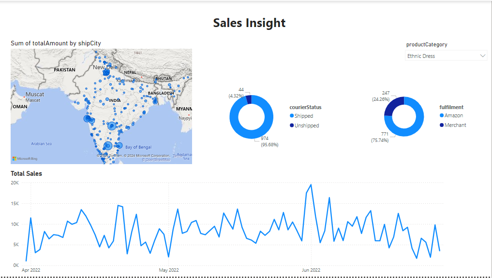

# Niloofar Moosavi
## Big Data and Cloud - DE23

## Architecture
The key components include:

1. **Azure Subscription**: A subscription was created to manage all the resources.

2. **Azure Resource Group**: A resource group was established to organize all related services.

3. **Azure Storage Account**: A storage account was created with three containers:
   - **StructuredData**: Contains a CSV file with sales data from Amazon, sourced from Kaggle.
   - **UnstructuredData**: Contains an XML log file that was generated in Python.
   - **Curated**: Transformed data is stored here in Parquet format.

4. **Azure Data Factory (ADF)**: ADF is utilized to orchestrate data movement and transformation. Data from the storage account is extracted, transformed, and loaded into the curated folder in Parquet format.

5. **Azure Synapse Analytics**: Synapse is used for data exploration and querying. It allows running Spark SQL to create tables on top of the Parquet files and analyze the transformed data.

6. **Power BI**: Power BI is employed to create dashboards and visualizations based on the transformed data stored in Azure Synapse.

## Data Management
Data management was accomplished through an ETL (Extract, Transform, Load) process in Azure Data Factory. The following steps were taken:

1. **Extraction and Transformation**:
   - Sales data was transformed by casting `quantity` as an integer and `amount` as a double.
   - Filtering was applied with conditions (`Amount > 0`, `Qty > 0`, `!isNull(currency)`).
   - Selected a few columns, renamed them, derived `totalAmount` as `price * quantity`, and transformed the date column to the `yyyy-mm-dd` format (it was originally in the `dd-mm-yy` format).

2. **XML Log Data**: 
   - The log data was flattened, and a subset of columns was selected.
   - Created a `logId` by concatenating `userId` and `timestamp`.

      

       
   

## Screenshots
Below are screenshots from key steps in the process, highlighting the configuration and setup of the Azure services used in this solution:

1. **Creating Azure Data Lake Storage**:
    

        
    

2. **Creating Azure Data Factory**:
   - The Azure Data Factory (ADF) interface allows for the orchestration of data workflows. The screenshot below demonstrates the initial setup process for ADF, including selecting the appropriate resource group and naming the data factory.
   

       
   

3. **Blob Security - ADF and Storage**:
   - To ensure proper security measures, the following settings were configured:
     - **Blob Contributor Role**: This role allows ADF to access the storage account without exposing key access. The screenshot shows the assignment of the Blob Contributor role to the managed identity of ADF.
     

         
     

     - **Dataset Authentication**: The authentication type is selected to be 'system-assigned-managed-identity'.
     

         
     

4. **Creating Synapse**:
   - Azure Synapse Analytics was created to facilitate data exploration and analysis. The screenshot illustrates the setup of Synapse, including the selection of performance tiers and configurations for serverless resources.
   

       
   

   - **RBAC for Synapse**: The screenshot shows how access is managed, ensuring only authorized users can interact with Synapse resources.
   

       
   

   - **Serverless SQL Pool**: Utilizing the serverless option in Synapse allows for on-demand querying of data stored in the Parquet files without the need for provisioning dedicated resources. The screenshot displays the setup options available for creating serverless SQL pools, emphasizing scalability, cost-effectiveness, and flexibility in querying large datasets.
   

       
   

5. **Security**:
   - To enhance the security posture of the data architecture, key access to the storage account was disabled. The screenshot highlights this configuration, ensuring that access is managed solely through role-based permissions.
   

       
   

   - **Storage Encryption**: Data encryption settings were reviewed and configured to ensure that all data stored in the Azure Storage Account is encrypted at rest, providing an additional layer of security.
   

       
   

6. **Sales Insights**:
   - Finally, the Power BI dashboard provides visual insights derived from the sales and logs data. 
   

       
       
   

