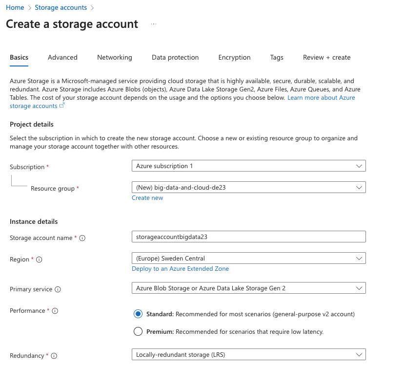
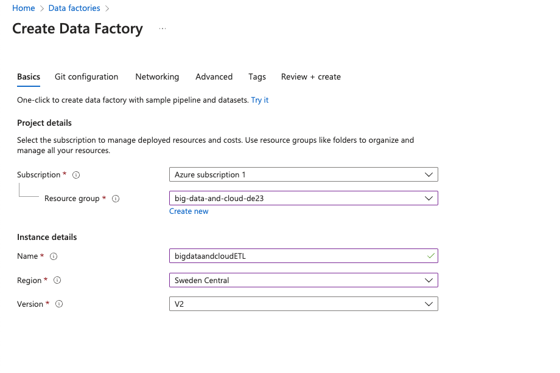
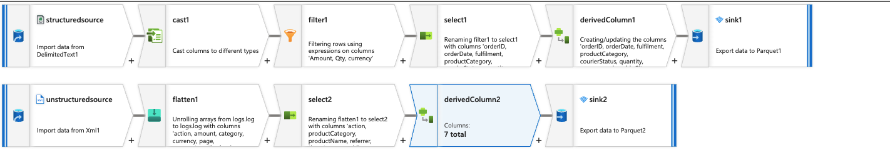
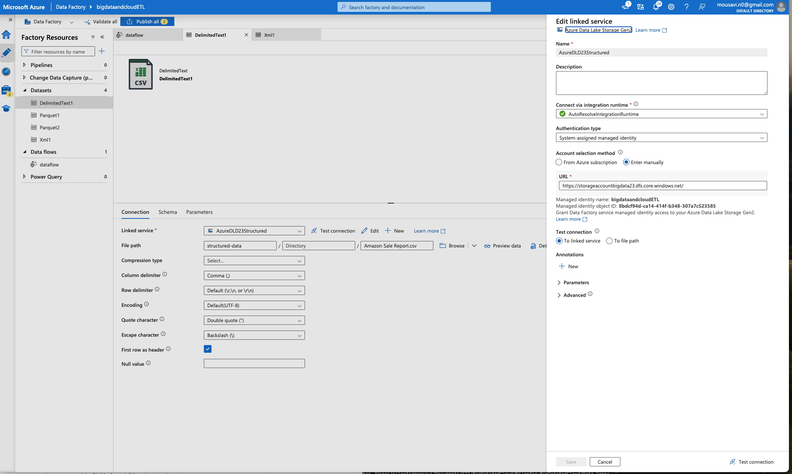
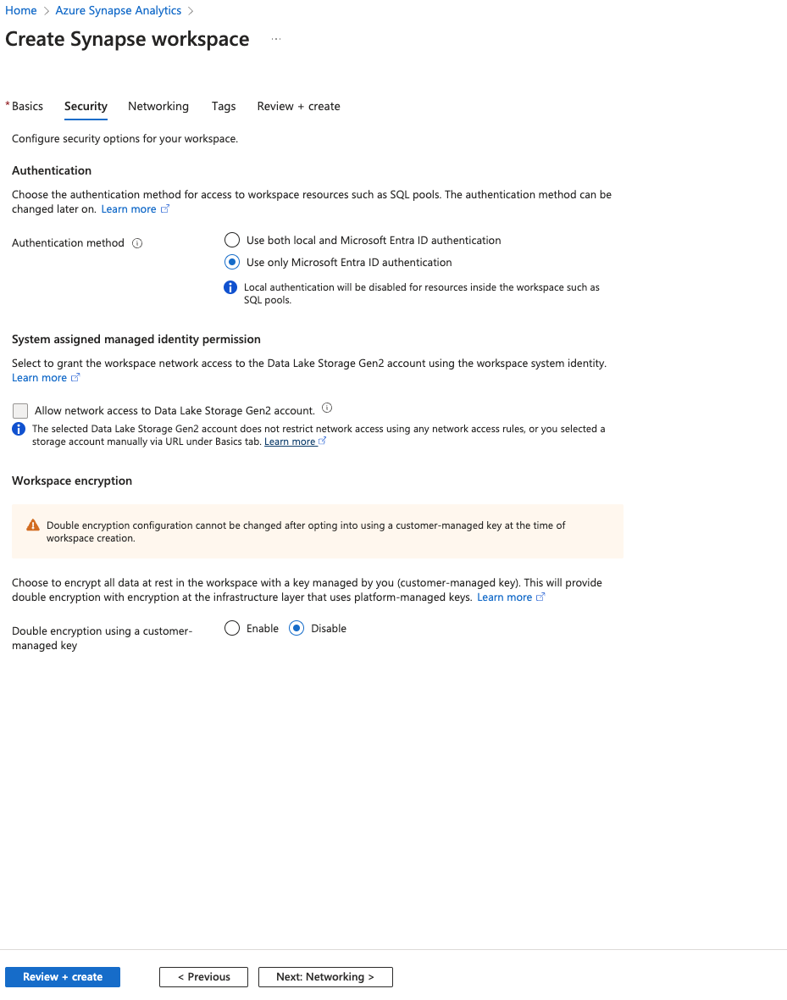

# Niloofar Moosavi
## Big Data and Cloud - DE23

## Architecture 
The key components include:

1. **Azure Subscription**: A subscription was created to manage all the resources.

2. **Azure Resource Group**: A resource group was established to organize all related services.

3. **Azure Storage Account**: A storage account was created with three containers:
   - **StructuredData**: Contains a CSV file with sales data from Amazon, sourced from Kaggle.
   - **UnstructuredData**: Contains an XML log file that was generated in Python.
   - **Curated**: Transformed data is stored here in Parquet format.


    **Creating Azure Data Lake Storage**:
    <div style="text-align: center;">
        
    </div>

4. **Azure Data Factory (ADF)**: ADF is utilized to orchestrate data movement and transformation. Data from the storage account is extracted, transformed, and loaded into the curated folder in Parquet format.

    **Creating Azure Data Factory**:
   - The screenshot below demonstrates the initial setup process for ADF, including selecting the appropriate resource group and naming the data factory.
   <div style="text-align: center;">
       
   </div>

5. **Azure Synapse Analytics**: Synapse is used for data exploration and querying. It allows running Spark SQL to create tables on top of the Parquet files and analyze the transformed data.

    **Creating Synapse**:
   - The screenshot illustrates the setup of Synapse, including the selection of performance tiers and configurations for serverless resources.
   <div style="text-align: center;">
       
   </div>

    **Data Exploration**:

    I used this sql query to create a table on top of the data 

    
    ```sql
    %%sql
    CREATE TABLE logs USING PARQUET
    LOCATION 'abfss://curated@storageaccountbigdata23.dfs.core.windows.net/logs'
    ```
    Here are some example results from the log data:

    <div style="text-align: center;">
        
    </div>


    <div style="text-align: center;">
        
    </div>

    And some example results from the sales data:


    <div style="text-align: center;">
        
    </div>


    <div style="text-align: center;">
        
    </div>


    <div style="text-align: center;">
        
    </div>


6. **Power BI**: Power BI is employed to create dashboards and visualizations based on the transformed data stored in Azure Synapse.


## Data Management

Data management for this project was achieved through a comprehensive ETL (Extract, Transform, Load) pipeline built in Azure Data Factory (ADF). This pipeline was designed to ensure data quality, facilitate efficient transformations, and prepare datasets for advanced analysis. Below are the detailed steps undertaken:

1. Extraction:

    - The sales data, sourced from a structured CSV file, was ingested into Azure Data Factory from the StructuredData container in the Azure Storage Account.

    - The XML log data, from the UnstructuredData container, was also ingested for further processing.

2. Data Transformation

    **Sales data:**

    - Type Casting: The quantity column was cast to integer and the amount column to double to standardize the data types for accurate calculations.

    - Data Filtering: A set of filters was applied to ensure data consistency and reliability:
    Only rows where Amount > 0 and Qty > 0 were retained.

    - Null or empty values in the currency field were excluded (!isNull(currency)).
    
    - Column Selection and Renaming: Only necessary columns were selected and renamed to align with naming conventions.
    This step reduced redundancy and improved clarity for downstream processes.

    - Derived Columns: Additional calculated fields were introduced:
    totalAmount was computed as the product of price and quantity.

    - Date Transformation: The date column was reformatted from dd-mm-yy to the standardized yyyy-mm-dd format to ensure compatibility with analysis tools.

    **log data:**


    - Data Flattening: The nested structure of the XML log data was flattened to extract relevant details into a tabular format.

    - Column Selection: A subset of critical columns was chosen for further analysis to minimize processing overhead.

    - Derived Field: A unique identifier, logId, was created by concatenating userId and timestamp. This step ensured a unique key for tracking individual log events across the dataset.


3. Loading and Storage

    The transformed datasets were stored in the Curated container of the Azure Storage Account in Parquet format. This format was chosen for its efficient storage and querying capabilities.

### ETL Process Visual Representation
To illustrate the data management workflow, the following diagram summarizes the key steps involved in the ETL pipeline:

<div style="text-align: center;">
       
   </div>


## Security

- Data in the storage account is encrypted at rest.
    <div style="text-align: center;">
       
   </div>


    Morevoer, Azure uses Secure Socket Layer (SSL)/Transport Layer Security (TLS) protocols to encrypt data as it travels between applications and Azure services. This safeguards data from interception during transmission.
    
- To enhance the security posture of the data architecture, key access to the storage account was disabled. The screenshot highlights this configuration, ensuring that access is managed solely through role-based permissions.
   <div style="text-align: center;">
       
   </div>

- RBAC was used to access data in the blob storage:

    **Data factory's access to data:
   - To ensure proper security measures, the following settings were configured:
     - **Blob Contributor Role**: This role allows ADF to access the storage account without exposing key access. The screenshot shows the assignment of the Blob Contributor role to the managed identity of ADF.
     <div style="text-align: center;">
         
     </div>

     - **Dataset Authentication**: The authentication type is selected to be 'system-assigned-managed-identity'.
     <div style="text-align: center;">
         
     </div>

    **RBAC for Synapse**: The screenshot shows how access is managed, ensuring only authorized users can interact with Synapse resources.
   <div style="text-align: center;">
       
   </div>


## Scalability

**Serverless SQL Pool**: Utilizing the serverless option in Synapse allows for on-demand querying of data stored in the Parquet files without the need for provisioning dedicated resources. The screenshot displays the setup options available for creating serverless SQL pools, emphasizing scalability, cost-effectiveness, and flexibility in querying large datasets.
   <div style="text-align: center;">
       
   </div>


## Power BI Report

**Sales Insights**:
   - Finally, the Power BI dashboard provides visual insights derived from the sales and logs data. 
   <div style="text-align: center;">
       
       
   </div>